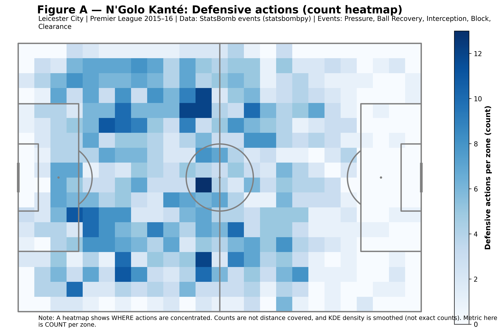
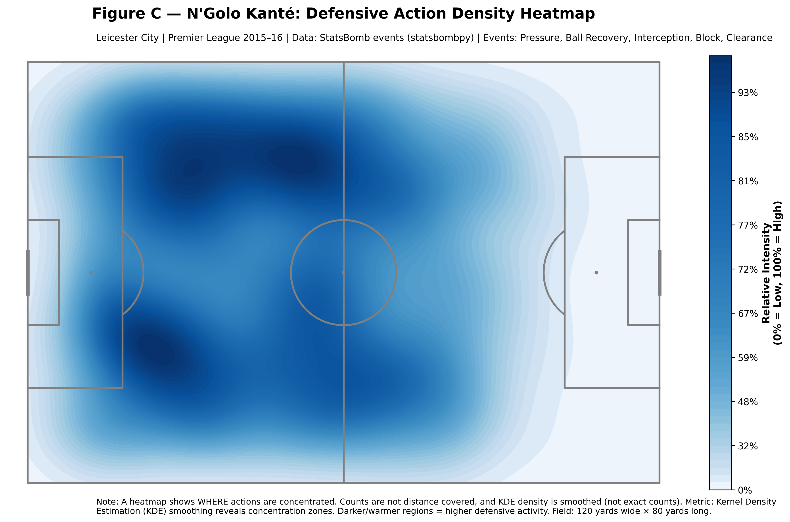

# Improving Soccer Heatmaps:

A Defensive Analysis of N’Golo Kanté (Leicester City, 2015–16)

This project reproduces and critically improves a popular soccer “player heatmap” visualization using **StatsBomb open event data**.
It focuses on **N’Golo Kanté’s defensive actions** during Leicester City’s historic 2015–16 Premier League title-winning season.

Rather than treating heatmaps as purely aesthetic graphics, this project applies **data visualization principles** to clarify what is being encoded, reduce ambiguity, and show how **different visual encodings tell different stories from the same data**.

---

## 📌 Why this project exists

Player heatmaps are everywhere in sports media — but they are often unclear or misleading.

Common problems include:

* unclear definitions of what “heat” represents
* missing context (season, league, team, event type)
* over-smoothed visuals that obscure actual data
* no distinction between **counts**, **density**, and **movement**

This project addresses those issues by:

* explicitly defining the **data and metric**
* separating **exact counts** from **smoothed density**
* adding proper **titles, subtitles, legends, and captions**
* presenting **multiple complementary visualizations**, each with a clear purpose

---

## 🧠 Visualization principles applied

This project draws on concepts from data visualization coursework and best practices:

* **Honest encoding**: no single “heatmap” is treated as the truth
* **Monotonic color scales** for quantitative data
* **Context-first design**: season, league, and event definitions are always visible
* **Multiple views** instead of one overloaded graphic
* Clear separation between:

  * *where events occurred*
  * *how often they occurred*
  * *how concentrated they appear*

---

## 📊 What this project produces

All figures are automatically saved to the `output/` directory.

### **Figure A — Defensive actions (binned count heatmap)**

* **Metric:** Exact count of defensive actions per pitch zone
* **Purpose:** Most transparent representation
* **Strength:** Easy to interpret and compare

### **Figure B — On-ball involvement (binned count heatmap)**

* **Metric:** Passes, carries, receptions, dribbles, shots
* **Purpose:** Adds tactical context beyond defensive work

### **Figure C — Defensive action density (KDE heatmap)**

* **Metric:** Kernel Density Estimation (smoothed intensity)
* **Purpose:** Highlights spatial tendencies and concentration
* **Important:** This shows *relative intensity*, not exact counts

### **Figure D — Defensive actions by half**

* **Metric:** Defensive action counts, split by match half
* **Purpose:** Reveals temporal changes in spatial behavior

### **Figure E — Raw defensive action points**

* **Metric:** One dot per event
* **Purpose:** Maximum transparency, no aggregation or smoothing

---

## 🖼️ Example outputs

### Defensive actions — count heatmap



### Defensive actions — KDE density



---

## 🗂️ Repository structure

```
kante-defensive-heatmaps_improvement/
├─ notebooks/
│  └─ critiquePaperFinal.ipynb     # Full narrative, critique, and exploration
├─ output/
│  ├─ A_defensive_count_heatmap.png
│  ├─ B_onball_count_heatmap.png
│  ├─ C_defensive_kde_density.png
│  ├─ D1_defensive_half1_count.png
│  ├─ D2_defensive_half2_count.png
│  └─ E_defensive_raw_points.png
├─ src/
│  ├─ fetch_data.py                # Download matches + event data
│  ├─ preprocess.py                # Cleaning, filtering, x/y extraction
│  ├─ plots.py                     # Plotting functions & styling
│  └─ main.py                      # Command-line entry point
├─ requirements.txt
└─ README.md
```

---

## 🚀 How to run this project

There are **two ways to run the project**, depending on your goals.

---

## Option 1 — Reproducible pipeline (recommended)

This is the **project-style, reproducible workflow**.

### 1) Install dependencies

Make sure you install using the same Python interpreter you will run:

```bash
python -m pip install -r requirements.txt
```

> ⚠️ If you use Conda, avoid mixing `pip` and `conda` unintentionally.
> Always use `python -m pip`.

---

### 2) Run the full pipeline

From the project root:

```bash
python -m src.main \
  --team "Leicester City" \
  --player "N''Golo Kanté" \
  --competition-id 2 \
  --season-id 27
```

All figures will be saved to:

```
output/
```

To see available options:

```bash
python -m src.main --help
```

---

## Option 2 — Notebook walkthrough (exploratory & explanatory)

If you want to **see every step and design decision**:

1. Open:

   ```
   notebooks/critiquePaperFinal.ipynb
   ```
2. Run cells from top to bottom

The notebook:

* explains data filtering choices
* shows intermediate results
* mirrors the logic used in `main.py`
* includes critique and interpretation

---

## ⚠️ Important details

### Player name spelling

StatsBomb uses the exact string:

```
"N''Golo Kanté"
```

Using `"N'Golo Kanté"` will return zero events.

---

### What “KDE” means

**KDE** stands for **Kernel Density Estimation**.

In this project:

* KDE heatmaps show *relative concentration*
* values are smoothed for readability
* they **do not** represent exact counts

This distinction is explicitly labeled in the figures.

---

## 📚 Data source

* **StatsBomb Open Data**
* Accessed via [`statsbombpy`](https://github.com/statsbomb/statsbombpy)

Used strictly for educational and non-commercial purposes.

---

## ✍️ Author

**Tite Divava**
Data Visualization & Analytics
Seattle University

---

## 🏁 Final note

This project demonstrates that:

> A good visualization is not just visually appealing —
> it is **honest, interpretable, and explicit about what it shows and what it does not**.
